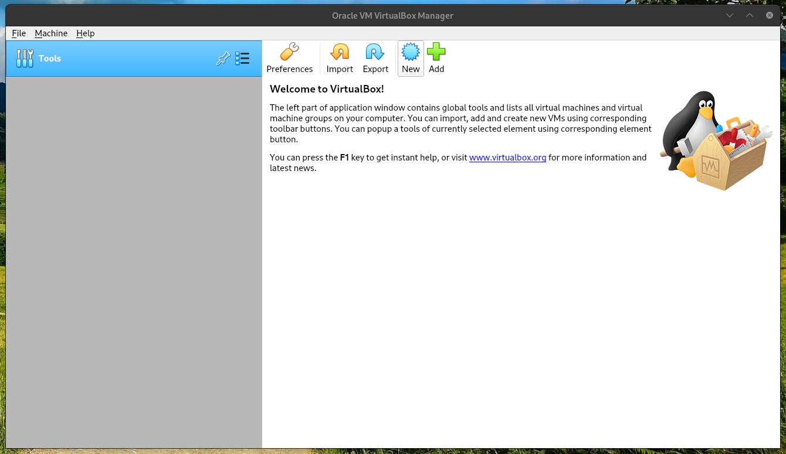
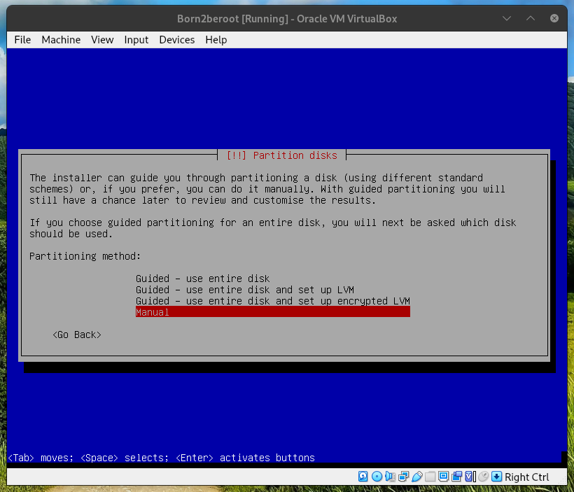
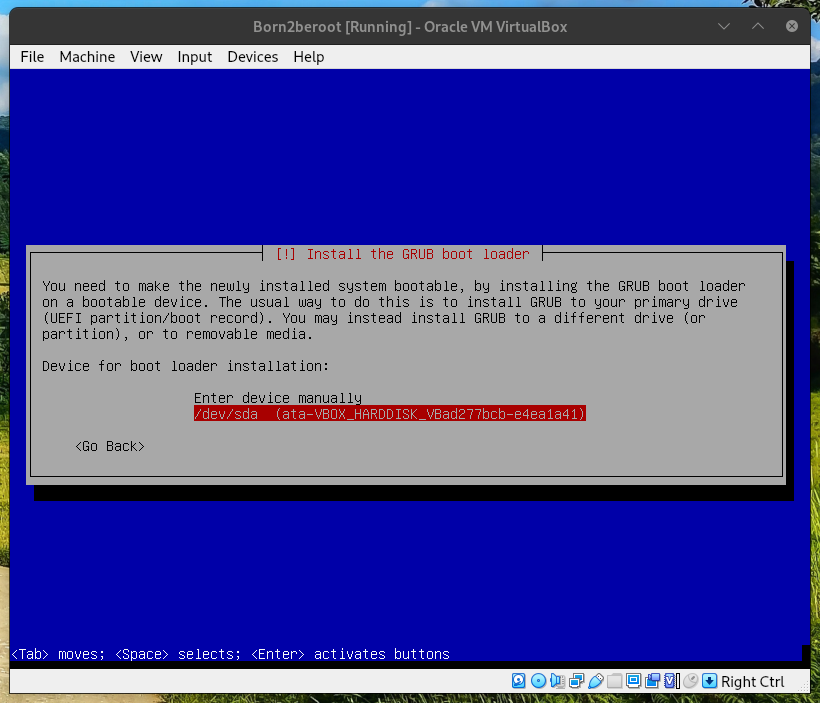

**the explanations in this file for some of the concepts remain mostly simplistic to keep it brief, additional information should be added to attain a greater understanding**

# Contents

- [choose OS](#choose-os)
- [install OS](#install-os)
- [install utilities](#install-utilities)
- [configure utilities](#configure-utilities)
- [connect to ssh server](#connect-to-ssh-server)
- [change password policy](#change-password-policy)
- [create group and configure sudo, change hostname](#create-group-and-configure-sudo-change-hostname)
- [Crontab script](#crontab-script)
- [Wordpress website](#wordpress-website)
- [info](#info)
- [credits](#credits)


## choose OS

**ROCKY VS DEBIAN**

-	Debian is a more general purpose distribution, it comes out the box with more features and applications, it is focused primarely on stability and ease of use making it the basis for a lot of other distros like Ubuntu, Mint, Arch, Debian is maintained by a team of volunteers over the internet.

It is more stable and portable, but slower to update.

-	Rocky linux is a distribution system based on the Red hat distro one of the most used linux distributions, thus it is an excelent distro but Rocky is more targeted towards server use and comes in with very little functionnality for this reason, Rocky is worked on by The Rocky Enterprise Software Foundation. 

It is better for servers and faster to update but less portable and stable.

## install OS

**installing OS on VMbox**

before even installing the OS you need to create a virtual machine, it is fairly straightforward.

to begin with open VMbox, VMbox for Virtual Box Manager is a free software capable of virtualization for a great many different operating systems, it is used by enterprises as well as home users.

VMbox runs on x86 hardware and only needs 512MB of RAM for the MBR plus the alloted memory for the OS(though more is always better).


*to learn more about MBR go to* [MBR](#info)


for a brief explanation of virtualization:

virtualization is the act of creating a virtual version of something at the same abstraction level, it can be done for computer hardware, storage devices and computer networks.


*create a new virtual machine* 



*for the present you should name the OS Born2beroot to stay consistent and if installed on school*
*grounds you should install in sgoinfre*


*the memory size (RAM) can be left as default* 


								       
*create a virtual hard disk*


the hard disk file type is not important, but it is good to know what each type does differently

-	**VDI** Virtual Disk Image it is the default VMbox hard disk file type and is widely used with other virutalization software thus very portable, it is the image of a virtual disk as opposed to a virtual disk, the image can be extended to add or remove space even while using it.

they are smaller and more efficient than VHD but slower than VMDK.

-	**VHD** Virtual Hard Disk acts just like a physical hard disk, they have flexible sizes and are good for pre-built systems.

the VHD has been superseded by VHDX the newer version which can hold more data.

-	**VMDk** Virtual Machine Disk allows for cloning of physical hard disk and backups of virtual machines off-site

VMDK allows incremental backups of changes to data from the time of the last backups.

*for this machine you should use the default* 


*Dinamically allocated*


*choose 30.80GB for the bonus partitions*


now the VM is created, to install the OS you need to insert the installation disk into the disk drive 

in a virtual sense it means you have to give the IDE(Integrated Drive Electronic) the image of the OS.

you can find the debian image here

[](https://cdimage.debian.org/debian-cd/current/amd64/iso-cd/)

*to add the image to the IDE go to settings*


*go to storage*


*in the Controller:IDE section give the OS image to the Optical Drive by clicking the disk icon on the side and choosing the debian iso*


*now that the image is loaded start the machine and install debian*


*the hostname of your machine should be the school login with 42*


*no need for a domain name*


*set the root password but careful, it's a secret* 🤫️


*btw use space to tick boxes*


<a name="back">
*now you will partition the disk, separate user data and system data.*
</a>

*the last guided method of partitioning uses the entire disk and sets up an encrypted LVM, but what is an LVM?*


*jump to [LVM](#lvm-🤷️) to find out* 🕵‍♂️️

*you can select the third option here, it will set up the right partitions with a higher level encrypted file managed by lvm*
*if you are doing the bonuses you should pick manual and create each partition exactly like the bonus part wants*
*i will go into the parts that might prove challenging but i leave the rest to you*
*so you will create the first partition, the boot partition like in the bonus*



*select the disk to partition*

*the disk in question is this*

    SCSI1 (0,0,0) (sda) - 12.9 GB ATA VBOX HARDDISK

*this is how it is structured*

    (current machine hardware) - (disk hardware)

-	**SCSI1**   refers to Small Computer System Interface 1(one for the version of SCSI) it is a standard for hardware interface

-	**(0,0,0)** 0<sup>1</sup> controller , 0<sup>2</sup> disk , 0<sup>3</sup> partition

-	**(sda)**   means the SCSI device 'a', a for which device, like so, sdb, sdc, sde, it means the first registered device

-	**12.9 GB** size

-	**ATA**  an interface type standard

-	**VBOX** virtual box

-	**HARDDISK** self-explanatory

*now all you have to do is create all the other partitions including the logical volumes, here are the specifics to be created in order*

**sda1	8:1		0	500M	0	part	/boot**

525M | primary | beginning | mount point /boot

**sda5	8:5		0	30.3	0	part**

max | logical | beginning | no mount

**sda5_crypt	8:2		0	1K		0	part**

configure encrypted volumes | yes | create encrypted volumes | sda5 | done | finish then enter your encryption password

**LVMGroup-root	254:1	0	10G		0	lvm		/**

configure the logical volume manager | yes | create logical volume | "LVMGroup" | sda5 create logical volume | LVMGroup | "root" | 10.7g

**LVMGroup-swap	254:2	0	2.3G	0	lvm		[SWAP]**

create logical volume | LVMGroup | "swap" | 2.5g , when all LV done, use as: | swap area

**LVMGroup-home	254:3	0	5G		0	lvm		/home**

create logical volume | LVMGroup | "home" | 5.4g , when all LV done, use as: | ext4 | mount point /home

**LVMGroup-var	254:4	0	3G		0	lvm		/var**

create logical volume | LVMGroup | "var" | 3.2g , when all LV done, use as: | ext4 | mount point /var

**LVMGroup-srv	254:5	0	3G		0	lvm		/srv**

create logical volume | LVMGroup | "srv" | 3.2g , when all LV done, use as: | ext4 | mount point /srv

**LVMGroup-tmp	254:6	0	3G		0	lvm		/tmp**

create logical volume | LVMGroup | "tmp" | 3.2g , when all LV done, use as: | ext4 | mount point /tmp

**LVMGroup-var--log	254:7	0	4G		0	lvm		/var/log**

create logical volume | LVMGroup | "var-log" | 4.3g , when all LV done, use as: | ext4 | mount point enter manually "/var/log"

**sda2	8:2		0	1K		0	part**

*this is the extended boot record it will be created automatically by grub*

*then prepare to wait*

# ⏳️


*the package manager needs to find the mirror on the debian network, for more info on how the debian package manager works check out [APT](#apt)*


*the GRUB is the Grand Unified Bootloader the GNU bootloader, during the installation debian will replace MBR and point to it's own boot file*




*finally done*


*the last thing to do is to unlock the encrypted disk*


*now login*


## install utilities

**install SSH/sudo/UFW**

the first step is gonna be to change current user to root

	su -

the su command goes for substitute user and allows you to run commands with a substitute user, if no user is defined then it will default to root.

it is fairly similar to sudo but differs in that sudo does not change the user but simply executes the command as the user.

here the flag [-] means login

now you can install sudo which allows you to execute a command as the superuser or another user.

	apt-get update
	apt-get upgrade
	apt install sudo

really there is no difference between doing apt-get and apt,
the apt command is a shell front end for APT (Advanced Packaging Tool)

so the command apt brings all thoses under a nice little package 📦️

install ssh 

	apt install openssh-server

SSH stands for Secure Shell Protocol it is a both a network protocole and an application that uses a cryptographic network to operate securely over an unsecured network.

install UFW (for a little overview of what UFW is go to [UFW](#ufw))

	apt install ufw


## configure utilities 

**configure sudo/SSH service/UFW**

1. SUDO

now that everything you need is installed let's configure some of the utilities, first set user to sudo group.

	usermod [options] LOGIN
	su -
	usermod -aG sudo djacobs

usermod goes for user modification, it allows you to modify the system account files to reflect the changes that are specified on the command line (i.e manage a user account)

the -a option adds the user to the supplementary group(s) it can only be used with the -G option which goes for the list of supplementary groups which the user is a also a member of.

you can then check the sudo group like this

	getent group sudo

now you need to edit the sudoers file to give user permission rights 

	sudo visudo

use sudo to get permission to use visudo command that let's you edit the sudoers file, sudoers is a policy plugin that determines a user's sudo priviledges, it is the default sud policy plugin.

once in the file write

	djacobs ALL=(ALL) ALL

a typical line is divided like so

	root    ALL=(ALL:ALL) ALL

-	**root** username the rule applies to
-	**ALL(1)** indicates the rule applies to ALL hosts
-	**ALL(2)** indicates that this user can execute commands as ALL users
-	**ALL(3)** indicates that this user can execute commands as ALL groups
-	**ALL(4)** indicates the rule applies to ALL commands

2. SSH

you can check the SSH status with this 
	systemctl [OPTIONS...] COMMAND [UNIT...]
    sudo systemctl status ssh

systemctl goes for system contrl, to control the systemd system and service manager, it's used to introspect and control the state of the "systemd" system and service manager

ssh is currently installed, to make sure it is running let's restart
	service {service} [OPTION] ##this isn't exactly the prototype for this command
	service ssh restart

the service command is used to control SysVinit(System V initalisation) services through SysVinit scripts, System V is just the name for one of the first commercial version of UNIX

now change the default port(22) to 4242

    sudo nano /etc/ssh/sshd_config

nano is the default debian text editor

look for the line

	#Port 22

and simply change it to this exact line

	Port 4242

you can check for that the line is properly changed with grep

	sudo grep /etc/ssh/sshd_config

then restart ssh again

3. UFW

UFW or Uncomplicated Firewall is a program for managing a netfilter firewall

to learn more about it go to [UFW](#ufw)

before you can connect to the ssh server you have to configure ufw
first off enable ufw

	sudo ufw enable

check the status

	sudo ufw status numbered

then configure the rules

	sudo ufw allow ssh

configure the port rules

	sudo ufw allow 4242

you can delete the new rule like this.

	sudo ufw status numbered 
	sudo ufw delete (the order number, 1 for the first rule, 2 for the second rule)

## connect to SSH server

to connect to the ssh server go to VMbox settings


then go to Network->Adapter 1->Advanced->Port Forwarding


create a new rule and write these values


then restart the SSH server in the machine

	sudo systemctl restart ssh

check the status 

	sudo service ssh status

then you can connect to the server

	ssh djacobs@127.0.0.1 -p 4242

then exit connection 

	exit

## change password policy

one of the thing you have to do is change the password policy with these rule

- the password has to expire every 30 days.

- the minimum number of days allowed before the modification of a password will beset to 2.

- your password must be at least 10 characters long, it must contain an uppercase letter, a lowercase letter and a number, also it must not contain more than 3 consecutive identical characters.

- the password must not include the name of the user

- the following rule does not apply to the root password: the password must have at least 7 characters that are not part of the former password

to do this you need the library parameter-password quality tools which allow you to configure parameters for weak passwords

	sudo apt install libpam-pwquality

then edit the parameter file

	sudo nano /etc/pam.d/common-password

find this rule, this rule describes what the rule applies to (pam_unix.so), the obscure option enables complexity checks.

sha512 enforces password encryption and decryption algorithm of the hash function.

	password	[success=2 default=ignore]	pam_unix.so obscure sha512

add minlen=10

	password	[success=2 default=ignore]	pam_unix.so obscure sha512 minlen=10

then look for 

	password requisite		pam_pwquality.so retry=3

and add the following

lcredit=-1 for minimum lower case.
ucredit=-1 for minimum upper case.
dcredit=-1 for minimum number of numbers.
maxrepeat=3 for maximum amount of repeating character.
usercheck=0 for wether or not the password contains USER name. 
difok=7 for different characters from previous password.
enforce_for_root for enforcing to the root user.

it should look like this on one line

	password requisite	pam_pwquality.so retry=3 lcredit=-1 ucredit=-1 dcredit=-1 maxrepeat=3 usercheck=0 difok=7 enforce_for_root 

for the password expiration 

	sudo nano /etc/login.defs

look for these lines

	PASS_MAX_DAYS 9999
	PASS_MIN_DAYS 0
	PASS_WARN_AGE 7

and change it to a maximum of 30 days and minimum of 2

	PASS_MAX_DAYS 30
	PASS_MIN_DAYS 2
	PASS_WARN_AGE 7

then reboot for the changes

	sudo reboot

## create group and configure sudo, change hostname

**create a user and assign to a group then configure sudo group and change hostname**

- **1 user**

so first let's create a group to evaluate

	sudo groupadd djacobs42
	sudo groupadd evaluating

you can check if the group is created

	getent group

next you have to create a user and assign to the group, let's check all the local users by looking at the file

	cut -d: -f1 /etc/passwd

here the cut command line will select a part of the lines from each file to standard output, the '-d' flag will delimit the first part from the specified character ':' '-f1' will select the delimited field, this cuts out only the part you need to see.

create the user

	sudo adduser new_username

assign a user into the evaluating group when you defend 

	sudo usermod -aG djacobs42 djacobs
	sudo usermod -aG evaluating  new_username

then check if the user is in the group 

	getent group djacobs42
	getent group evaluating

you can check which group a user belongs to 

	groups

you can check if the password rules work on the new user

	chage -l new_username

the chage command allows you to change the user password expiry information the system uses it to check when a user has to change their password.

the '-l' flag goes fo list

-	**2 sudo**

now you need to setup a strong configuration for your sudo group, here are the requirements you have to follow

- authentification using sudo has to be limited to 3 attempts in the event of an incorrect password

- a custom message of your choice has to be displayed of an error due to a wrong password occurs using sudo

- each action using sudo has to be archived, both inputs and ouptus, the log file has to be saved in the /var/log/sudo folder

- the TTY mode has to be enabled for security reasons

- for security reasons too, the paths that can be used by sudo must be restricted, example:

/usr/local/sbin:/usr/local/bin:/usr/sbin:/usr/bin:/sbin:/bin:/snap/bin

go to the sudoers file.

	sudo nano /etc/sudoers

and add the following lines to secure the path

	Defaults	secure_path="..."
	Defaults	passwd_tries=3

secure paths is the path that the sudo command uses whenever it calls a command.

write a custom error message in case of an error with the password, the message can be anything you want

	Defaults	badpass_message="error: invalid password"	

now add the new log file with the input output.

	Defaults	logfile="/var/log/sudo/sudo.log"
	Defaults	log_input,log_output

now write this line to activate the TTY mode, tty is a command to provide the file name of the terminal connected to the standard input.

it is a security measure.

	Defaults	requiretty

and finally this line to secure the paths though it might already be in there.

	Defaults	secure_path="/usr/local/sbin:/usr/local/bin:/usr/sbin:/usr/bin:/sbin:/bin:/snap/bin"

-	**3 hostname**

it is good to know how to change the hostname during the defense, first let's check the hostname.

	hostnamectl

this gives you a lot of information not only of the hostname but of the whole machine.

now change the hostname like this.

	hostnamectl set-hostname new_hostname

then change the /etc/hosts file by going to.

	sudo nano /etc/hosts

and your old hostname to the new one. 

	127.0.0.1	localhost
	127.0.0.1	djacobs42

then reboot and check the changes.

	sudo reboot
	hostnamectl

## Crontab script

the last thing to do ommiting the bonuses.

first off you will need to install netstat, a tool to get information on network connections, it will be used in the script.

	apt install net-tools

cron is a command line utility job scheduler which manages background tasks.

crontab files are used to schedule execution of programs. 

this is that script, if you want to know what each command does go [HERE](#script-info):

	#!/bin/bash
	wall $'#Architecture: ' `uname -a` \
	$'\n#CPU physical: '`cat /proc/cpuinfo | grep processor | wc -l` \
	$'\n#vCPU:  '`cat /proc/cpuinfo | grep processor | wc -l` \
	$'\n'`free -m | awk 'NR==2{printf "#Memory Usage: %s/%sMB (%.2f%%)", $3,$2,$3*100/$2 }'` \
	$'\n'`df -h | awk '$NF=="/"{printf "#Disk Usage: %d/%dGB (%s)", $3,$2,$5}'` \
	$'\n'`top -bn1 | grep load | awk '{printf "#CPU Load: %.2f\n", $(NF-2)}'` \
	$'\n#Last boot: ' `who -b | awk '{print $3" "$4" "$5}'` \
	$'\n#LVM use: ' `lsblk |grep lvm | awk '{if ($1) {print "yes";exit;} else {print "no"} }'` \
	$'\n#Connection TCP:' `netstat -an | grep ESTABLISHED |  wc -l` \
	$'\n#User log: ' `who | cut -d " " -f 1 | sort -u | wc -l` \
	$'\n#Network: IP ' `hostname -I`"("`ip a | grep link/ether | awk '{print $2}'`")" \
	$'\n#Sudo:  ' `grep 'sudo ' /var/log/auth.log | wc -l`

This file is named monitoring.sh and placed in /usr/local/bin/

Next you have to add a rule to make it execute without sudo permission, to do this go into sudoer

     Sudo visudo

And add this line

your_username ALL=(ALL) NOPASSWD: /usr/local/bin/monitoring.sh

Here the rule NOPASSWD indicates that no password is required for permission to execute.

After this, reboot.

     Sudo reboot

And execute the script as root 

     $ sudo /usr/local/bin/monitoring.sh

Then open crontab and add the rule

    $ sudo crontab -u root -e

Here the command crontab used with the option u for user then indicating root for the user whose crontab you are modifying, then e for editor which will open in the editor.

Then add the following line at the end 

     */10 * * * * bash /usr/local/bin/monitoring.sh

If an error occurs when the VM is rebooted, it might be a problem with the display see [here](https://unix.stackexchange.com/questions/502540/why-does-drmvmw-host-log-vmwgfx-error-failed-to-send-host-log-message-sh)

     $ drm:vmw_host_log *ERROR* Failed to send host log message.

## wordpress website

now for the bonus part of the exercise, you have to install a wordpress website with lighttpd, MariaDB and PHP.

So first off what are those ?

Lighttpd is a webserver for speed critical environement like handling 100000 connections at once, The low memory footprint (compared to other web servers), small CPU load and speed optimizations make lighttpd suitable for servers that are suffering load problems, lighttpd is free and open-source software and is distributed under the BSD license. It runs natively on Unix-like operating systems, as well as Microsoft Windows.

MariaDB is a software for managing database, it allows the user to create, maintain, control and define access to the database.

and PHP for hypertext preprocessor is a programmation language mainly used to make dinamyc websites by an http server, it also works as any other programming language.

first off let's install PHP, you need to install the sury package this is the PHP package for Debian.

	sudo apt update
	sudo apt install curl
	sudo curl -sSL https://packages.sury.org/php/README.txt | sudo bash -x
	sudo apt update

curl is a tool for transfering data from or to a server, the options -sSL -s goes for silent to run in silent mode, -S show error when used with -s will show error if it fails, if the http server reports that the requested page has moved to a different location this option will make curl redo the request on the new place.

these options are not necessary and are only there in case of an error, the pipe to sudo bash -x will execute the script fetched from the address as it is read. 

the script will add the sury repository. 

	sudo apt install php8.2
	sudo apt install php-common php-cgi php-cli php-mysql

their might be some conflict between apache and lighttpd so you might have to uninstall it.

	apt purg apache2

this will install some of the php packages, make sure that you install the latest version of php.

then install lighttpd

	sudo apt install lighttpd
	sudo systemctl start lighttpd
	sudo systemctl enable lighttpd
	sudo systemctl status lighttpd

then allow http port 80 through UFW

	sudo ufw allow http
	sudo ufw allow 80
	sudo ufw status

then forward host port to guest port 

* Go to VM >> ```Settings``` >> ```Network``` >> ```Adapter 1``` >> ```Port Forwarding```
* Add rule for host port ```8080``` to forward to guest port ```80```

To test Lighttpd, go to host machine browser and type in address http://127.0.0.1:8080 or http://localhost:8080. You should see a Lighttpd "placeholder page".

Back in VM, activate lighttpd FastCGI module:

	sudo lighty-enable-mod fastcgi
	sudo lighty-enable-mod fastcgi-php
	sudo service lighttpd force-reload

to test lighttpd, create a file in /var/www/html called info.php


	<?php
	phpinfo();
	?>

save and go to host browser and type in the address http://127.0.0.1:8080/info.php

now to install MariaDB

	sudo apt install mariadb-server
	sudo systemctl start mariadb
	sudo systemctl enable mariadb
	systemctl status mariadb

then install the MySQL secure installation

	sudo mysql_secure_installation

then for the installation enter the following.

-	none | Y | Y | Newpass1# | Newpass1# | Y | Y | Y | Y

restart the service 

	sudo systemctl restart mariadb

then enter the interface 

	mysql -u root -p 

enter MariaDB root password then create a database for WordPress

	MariaDB [(none)]> CREATE DATABASE wordpress_db;
	MariaDB [(none)]> CREATE USER 'admin'@'localhost' IDENTIFIED BY 'password';
	MariaDB [(none)]> GRANT ALL ON wordpress_db.* TO 'admin'@'localhost' IDENTIFIED BY 'password' WITH GRANT OPTION;
	MariaDB [(none)]> FLUSH PRIVILEGES;
	MariaDB [(none)]> EXIT;

you can then check for the database like this 

	MariaDB [(none)]>show databases
first off you create the database, then create user admin at the localhost, then you grant all privileges on the database you created to the user with grant options allowing the user to pass on privileges on other users, then flush privileges to apply them and exit.

now to install Wordpress, first you need two tools.

	sudo apt install wget
	sudo apt install tar

wget is a software to download files from the web.

tar is a tool to manipulate archives.

then download the latest version of Wordpress using wget, extract the archive move it and clean the rest.

	wget http://wordpress.org/latest.tar.gz
	tar -xzvf latest.tar.gz
	sudo mv wordpress/* /var/www/html/
	rm -rf latest.tar.gz wordpress/

create a Wordpress configuration file like this.

	nano /var/www/html/wp-config.php

then edit like this 
	<?php
	define( 'DB_NAME', 'wordpress_db' );
	define( 'DB_USER', 'admin' );
	define( 'DB_PASSWORD', 'password' );
	define( 'DB_HOST', 'localhost' );

then change permission for Wordpress directory to grant rights to the web server and restart lighttpd, so first you change the file owner using chown and -R as recursive then change file permission using chmod -R recursive and the rights to change in decimal form, then restart.

	sudo chown -R www-data:www-data /var/www/html/
	sudo chmod -R 755 /var/www/html/
	sudo systemctl restart lighttpd

then in host browser you can connect to http://127.0.0.1:8080 and finish the Wordpress installation

## INFO

### Script info

here is the script, let's go trough each command:

	#!/bin/bash
	wall $'#Architecture: ' `uname -a` \
	$'\n#CPU physical: '`cat /proc/cpuinfo | grep processor | wc -l` \
	$'\n#vCPU:  '`cat /proc/cpuinfo | grep processor | wc -l` \
	$'\n'`free -m | awk 'NR==2{printf "#Memory Usage: %s/%sMB (%.2f%%)", $3,$2,$3*100/$2 }'` \
	$'\n'`df -h | awk '$NF=="/"{printf "#Disk Usage: %d/%dGB (%s)", $3,$2,$5}'` \
	$'\n'`top -bn1 | grep load | awk '{printf "#CPU Load: %.2f\n", $(NF-2)}'` \
	$'\n#Last boot: ' `who -b | awk '{print $3" "$4" "$5}'` \
	$'\n#LVM use: ' `lsblk |grep lvm | awk '{if ($1) {print "yes";exit;} else {print "no"} }'` \
	$'\n#Connection TCP:' `netstat -an | grep ESTABLISHED |  wc -l` \
	$'\n#User log: ' `who | cut -d " " -f 1 | sort -u | wc -l` \
	$'\n#Network: IP ' `hostname -I`"("`ip a | grep link/ether | awk '{print $2}'`")" \
	$'\n#Sudo:  ' `grep 'sudo ' /var/log/auth.log | wc -l`

first off the shebang giving the path of the shell and the interpreter bash

this is the first command, it is pretty simple.

	wall $'#Architecture: ' `uname -a` \

uname prints the system information and the option -a gives all the informations.

the second line 

	$'\n#CPU physical: '`cat /proc/cpuinfo | grep processor | wc -l` \

it is a continuation of the first line that starts out with a newline, it prints '\n#CPU physical: ' and subtitutes to a cat for the /proc/cpuinfo piped to a grep to take the processor line, and wc gives the amount of lines counted.

this way we get the number of physical cpu processes.

the third line

	$'\n#vCPU:  '`cat /proc/cpuinfo | grep processor | wc -l` \

this is the same line as before, because there is a same amount of virtual and physical processors.

the fourth line. 

	$'\n'`free -m | awk 'NR==2{printf "#Memory Usage: %s/%sMB (%.2f%%)", $3,$2,$3*100/$2 }'` \

print newline, then substitute to free -m to display the amount of free and used memory in the system using mebibytes, the awk command will scan the line for the right pattern, in this case the pattern to match is 'NR==2' NR goes for the number of lines so when gawk has read 2 lines it will print "#Memory Usage: %s/%sMB (%.2f%%)" using the function printf with the variables $3,$2,$3*100/$2 which each correspond to a field in the output of free with '%.2f' giving the decimal up to two numbers, giving the amount of memory and the percentage used.

the fifth line..

	$'\n'`df -h | awk '$NF=="/"{printf "#Disk Usage: %d/%dGB (%s)", $3,$2,$5}'` \

newline then substitute to the command df which displays the amount of disk space available on the file system containing each file name argument, the option -h gives readable sizes, this is then piped to awk with the condition of $NF=="/" NF goes for the number of fields and will look for '/' in the fields, when found it will print the information of per field on that line, the '\' field will correspond to the root mount type.

the sixth line.

	$'\n'`top -bn1 | grep load | awk '{printf "#CPU Load: %.2f\n", $(NF-2)}'` \

newline, substitute to top command displaying the Linux processes with the options 'b'+'n'+'1' each respecively corresponds to 

-	**Batch-mode:** Starts top in Batch mode, in this mode top will not accept input and runs until the iterations limit you've set with the '-n' option or until killed.

-	**Number-of-iterations:** Specifies the maximum number of iterations or frames top should produce before ending.

-	**Single/Separate-Cpu-States:** Starts top with the last remembered Cpu states portion of the summary area reversed.

then pipe to grep and look for the 'load' line, pipe to awk and printf the information on the line up to two decimal, that info is the second field. giving the average of the cpu load on the system.

the seventh line 

	$'\n#Last boot: ' `who -b | awk '{print $3" "$4" "$5}'` \

prints '\n#Last boot: ' then substitutes to the who command showing who is logged on with the '-b' option for time of last system boot piped to awk that prints the selected fields.

the eighth line

	$'\n#LVM use: ' `lsblk |grep lvm | awk '{if ($1) {print "yes";exit;} else {print "no"} }'` \

prints '\n#LVM use: ' then substitutes to lsblk then pipes to grep looking for lvm, then pipes to awk, here awk uses a conditional if statement, if ($1) so if the first field is true(if there is a first field) then print "yes" and exit, else print "no".

like so you can check wether lvm is being used or not.

the ninth line

	$'\n#Connection TCP:' `netstat -an | grep ESTABLISHED |  wc -l` \

in this line '\n#Connection TCP: ' is printed then substitute to the netstat tool to print network connections and divers network information, the options '-an' go respectively for all to show both listening and non-listening sockets and numeric to show numerical addresses instead of trying to determine symolic host.

this then is piped to grep looking for 'ESTABLISHED' then piped to the wc command giving the nummber of lines in list format.

this way you get the number of TCP connections

the tenth line

	$'\n#User log: ' `who | cut -d " " -f 1 | sort -u | wc -l` \

the line '\n#User log: ' is printed then a substitute to the who command, piped to cut delimiting spaces and taking the first field then piped to the sort command which will sort the lines given into equal parts, then piped to wc to give the amount of users.

the eleventh line

	$'\nNetwork: IP ' `hostname -I`"("`ip a | grep link/ether | awk '{print $2}'`")" \

Prints the line '\nNetwork IP ' then substitutes to the command hostname which allows you to show or set the system host name, the option '-i' will give you all the ip addresses.

Then print "(" then substitutes to ip a net-tool for system administrators the option a is used to display and modify network adresses, then pipe to grep looking for link/ether pipe to awk then print the second field, exit substitute and print ")".

The twelfth line 

$'\n#Sudo:  ' `grep 'sudo ' /var/log/auth.log | wc -l`

Finally the last line will print '\n#Sudo: ' then substitute to grep which will look for sudo in the /var/log/auth.log file then pipe to wc to get the number of lines taken.

[back](#Crontab-script)

[up](#contents)

### MBR 💽️

MBR for Master Boot Record is located on the first disk sector of mass storage devices like fixed disks or removable drives, it contains a partition table containing information on how the disc's sectors are divided into partitions, the MBR also contains executable code to function as a loader for the installed operating system—usually by passing control over to the loader's second stage, or in conjunction with each partition's volume boot record (VBR). This MBR code is usually referred to as a boot loader.

it consists of 512 or more bytes located in the first sector of the drive.

the MBR has now been superseded by GPT the GUID partition table (Globally Unique Identifiers) due to only being limited to 32 bits of logical block addressing, it could only go up to 2tb.

GPT uses 64 bytes for logical block addresses, allowing a maximum disk size of 264 sectors. For disks with 512‑byte sectors, the maximum size is 8 ZiB (264 × 512‑bytes) or 9.44 ZB (9.44 × 10²¹ bytes). For disks with 4,096‑byte sectors the maximum size is 
64 ZiB (264 × 4,096‑bytes) or 75.6 ZB (75.6 × 10²¹ bytes).

[back](#install-os)

[up](#contents)

### APT

APT (Advanced Package Tool) is a free-software user interface that works with core libraries to handle the installation and removal of software on Debian, and Debian-based Linux distributions. APT simplifies the process of managing software on Unix-like computer systems by automating the retrieval, configuration and installation of software packages, either from precompiled files or by compiling source code.

apt is the command to handle that software.

aptitude is a front-end to APT, it displays a list of software packages and allows the user to interactively pick packages to install or remove. It has an especially powerful search system utilizing flexible search patterns. It was initially created for Debian, but has appeared in RPM-based distributions as well.

here is how packages are delivered to end user in Debian

	            ________________________   ________   ____________
	 ________  |  _________   ________  | | server | |autobuilders|
	|upstream|_|_|packaging|_|updating|_|_|________|_| _________  |
	|author  | | |_________| |________| | | |repo| | ||_________| |
	|________| |   package mainteners   | | |____| | | _________  |
	           |________________________| | |.deb| | ||_________| |
	                                      | |____| | | _________  |
	                                      |________| ||_________| |
	                                        ___|__   |____________|
	                                       |mirror|
	                                       |______|
	                                           |  <----using /etc/apt/sources   
	                                       end user

the upstream author sends the package to the package mainteners who package it, update it and compile it then send it to the server repo.

the .deb package is then stored on the server, autobuilders manage the package compilation for different architecture, it is network of several machines that use a specific software package called buildd to pick up packages from the Debian archive and rebuild them for the target architecture.

the end user gains access to the package through the mirror.

[back](#install-utilities)

[up](#contents)

### UFW

UFW Uncomplicated Firewall is a user-space utility that allows a system administrator to manage a netfilter firewall, it uses a command line interface designed for ease of use, ufw uses iptables for configuration.

iptables are utilities part of the netfilter framework that can also be used to configure the netfilter, ufw is more easy to use but iptables are more complete in functionality.

now what is the netfilter, the netfilter is a framework provided by the Linux kernel that allows various networking-related operations to be implemented in the form of customized handlers. Netfilter offers various functions and operations for packet filtering, network address translation, and port translation, which provide the functionality required for directing packets through a network and prohibiting packets from reaching sensitive locations within a network.

Netfilter represents a set of hooks inside the Linux kernel, allowing specific kernel modules to register callback functions with the kernel's networking stack. Those functions, usually applied to the traffic in the form of filtering and modification rules, are called for every packet that traverses the respective hook within the networking stack.

here is a little overview of some of the components of the netfilter:

	     ____________________________________________________________________________________________________
	    | ebtables | arptables | ip6tables | iptables | iptables- | nft| conntrack       | ulogd2 | (custom) | level 1
	 ___|__________|___________|___________|__________| nftables  |____|_________________|________|__________|
	|///|__________|___________|___________|_______   |___________|    |_____|L3/4 |L7   |        |          | level 2
	|Br-|broute|nat/filter|filter|raw/mangle/filter|  |                |NAT  |tra- |help-|Logging |Queueing  |
	|id-|______|__________|______|_________________|  |    nf_tables   |engi-|ckers|ers  |via     |via       |
	|gi-|raw/mangle/filter|nat |           |          |                |ne   |_____|_____|nf_log  |nf_queue  |
	|ng/|_________________|____|           |          |                |_____| Connection|        |          |
	|///| ebtables | arptables | ip6tables | iptables |                | NAT | tracking  |        |          |
	|///|__________|___________|___________|__________|                |     |           |        |          |
	|///| Xtables                                     |                |     |           |        |          |
	|///|_____________________________________________|________________|_____|___________|________|__________|
	|///| Netfilter hook API                                                             |                     '/' zone						
	|___|________________________________________________________________________________|
	|/from and to to network stack; hardware/////////////////////////////////////////////|
	|____________________________________________________________________________________|

level 1 is userspace tools 

level 2 is netfilter kernel components

'/' zone is other networking components

[back](#install-utilities)

[up](#contents)

### LVM 🤷️

		VG1		5MB
		 ____________________________________________________
		|   physical volume             logical volumes      |
		|   (physical extent 5mb)                            |
		|  ___________________________                       |
		| |  PE  |  PE  |  PE  |  PE  |	    /home___         |
		| |______|______|______|______|____|LE|LE|LE|        |
		|  ___________________________  |  '--------'        |
		| |  PE  |  PE  |  PE  |  PE  |	|   /var____         |
		| |______|______|______|______|_|__|LE|LE|LE|        |
		|  ___________________________     '--------'        |
		| |  PE  |  PE  |  PE  |  PE  |	    /tmp____         |
		| |______|______|______|______|____|LE|LE|LE|        |
		|                                  '--------'        |
		|____________________________________________________|
		 
*the physical volume contains physical extents, blocks of memory refered by logicla volumes and logical extents.*

*all is contained within the volume group, this allows for blocks to me moved, concatenate, stripe, etc...*

*the volume group defines the size of each block*

LVM (Logical Volume Manager) is a software/partition scheme used to manage memory by way of memory virtualization for system administrators to allow greater flexibility of use, it can concatenate, stripe or combine partitions into larger virtual partitions.

it partitions volumes into volume groups,containing logical volumes, those logical volumes are composed of physical volumes, physical volumes are a way to group physical extents set to specific size limits, with all this the physical volumes can be manipulated in any way within the logical volume which is a virtual partition, a level of abstraction over physical storage.

the LVM uses device files, device files are also called special files or special nodes they are abstract files not real files used as interfaces for the device driver that communicates to the device itself.

there is two types of device files character device and block device

-   **character device** - character device provides unbuffered direct accces to hardware device, response time and processing speeds are much better due to DMA(Direct Memory Access) which is a designated chip on the motherboard designed to allow direct access to processes without having to go through the CPU, this way the CPU can handle other requests while the process is accessing memory, if DMA is limited though then so is the advantage of character device

it is used for stream based devices.

-   **block device** - block device provides buffered access to hardware device by using one block at a time though the blocks can vary in sizes, this read and write of one block is what causes a buffering effect, in general block devices represent hardware such as disk drives, but that is platform-dependent as FreeBSD doesn't have any block devices at all.


the device mapper is a framework provided by the Linux kernel for mapping physical block devices(through device driver) onto higher-level virtual block devices, it forms the foundation of the logical volume manager (LVM)

Device mapper works by passing data from a virtual block device, which is provided by the device mapper itself, to another block device. Data can be also modified in transition, which is performed, for example, in the case of device mapper providing disk encryption or simulation of unreliable hardware behavior.

here are some of the DM targets 

-   **Linear**
    maps a continuous range of blocks onto another block device

-   **Striped** 
    stripes the data across physical devices, with the number of stripes and the striping chunk size as parameters

-   **Mirror**
    maps a mirrored logical device, while providing data redundancy

-   **Snapshot**
    used for creation of LVM snapshots, as part of the underlying copy-on-write scheme

-   **Crypt**
    provides data encryption and decryption

-   **Multipath**
    in order to provide higher reliablity, in case of failure of path to disk, data on the disk can be accessed through alternative paths

-   **Zero**
    returns all the data as zero for all operations on the disk

-   **Error**
    any I/O mapped to the disk fails

for more info on LVM, Device Mapper and device files check out the [ressources](../ressources.md).

[back](#back)

[up](#contents)

## credits

i would like to credit Baigalmaa Baatar and mcombeau for helping me and many other students on this project.

and i would also like to thank my parents whom i love very much ***cries*** and my brothers ***wipes fake tear*** this is the greatest day of my life ***everyone is clapping*** thank you so much ***torrent of applause*** 🏆️

Thank you for reading my stupid shit!