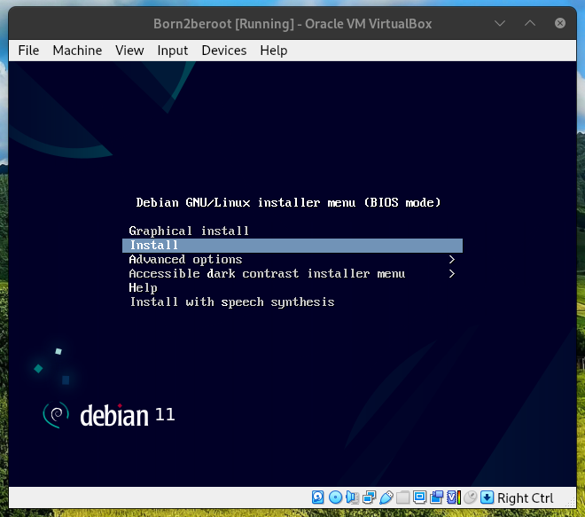
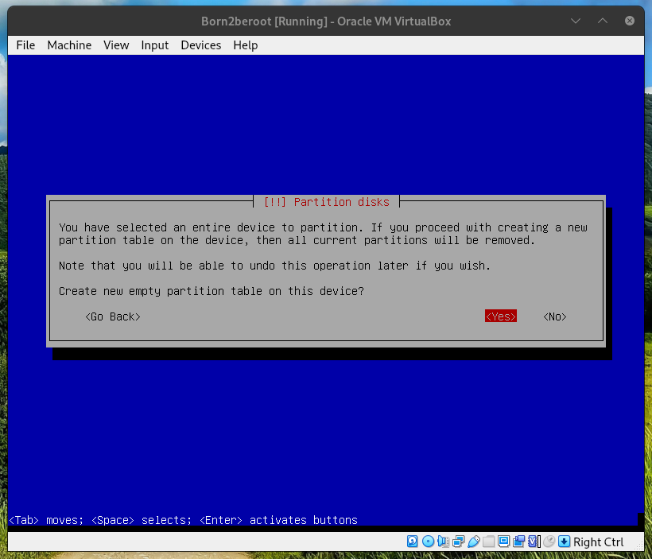

**the explanations in this file for some of the concepts remain mostly simplistic to keep it brief, additional information should be added to attain a greater understanding**

### choose OS

**ROCKY VS DEBIAN**

-	Debian is a more general purpose distribution, it comes out the box with more features and applications, it is focused primarely on stability and ease of use making it the basis for a lot of other distros like Ubuntu, Mint, Arch, Debian is maintained by a team of volunteers over the internet.

It is more stable and portable, but slower to update.

-	Rocky linux is a distribution system based on the Red hat distro one of the most used linux distributions, thus it is an excelent distro but Rocky is more targeted towards server use and comes in with very little functionnality for this reason, Rocky is worked on by The Rocky Enterprise Software Foundation. 

It is better for servers and faster to update but less portable and stable.

### install OS

**installing OS on VMbox**

before even installing the OS you need to create a virtual machine, it is fairly straightforward.

to begin with open VMbox, VMbox for Virtual Box Manager is a free software capable of virtualization for a great many different operating systems, it is used by enterprises as well as home users.

VMbox runs on x86 hardware and only needs 512MB of RAM for the MBR plus the alloted memory for the OS(though more is always better).

for a brief explanation of virtualization:

virtualization is the act of creating a virtual version of something at the same abstraction level, it can be done for computer hardware, storage devices and computer networks.

*create a new virtual machine* 

*for the present you should name the OS Born2beroot to stay consistent and if installed on school*
*grounds you should install in sgoinfre*

*the memory size (RAM) can be left as default* 

*create a virtual hard disk*

the hard disk file type is not important, but it is good to know what each type does differently

-	**VDI** Virtual Disk Image it is the default VMbox hard disk file type and is widely used with other virutalization software thus very portable, it is the image of a virtual disk as opposed to a virtual disk, the image can be extended to add or remove space even while using it.

they are smaller and more efficient than VHD but slower than VMDK.

-	**VHD** Virtual Hard Disk acts just like a physical hard disk, they have flexible sizes and are good for pre-built systems.

the VHD has been superseded by VHDX the newer version which can hold more data.

-	**VMDk** Virtual Machine Disk allows for cloning of physical hard disk and backups of virtual machines off-site

VMDK allows incremental backups of changes to data from the time of the last backups.

*for this machine you should use the default* 

*Dinamically allocated*

*leave default*

now the VM is created, to install the OS you need to insert the installation disk into the disk drive 

in a virtual sense it means you have to give the IDE(Integrated Drive Electronic) the image of the OS.

you can find the debian image here

*to add the image to the IDE go to settings*

*go to storage*

*in the Controller:IDE section give the OS image to the Optical Drive by clicking the disk icon on the side and choosing the debian iso*

*now that the image is loaded start the machine and install debian*

*the hostname of your machine should be the school login with 42*

*no need for a domain name*

*set the root password but careful, it's a secret* 🤫️

*btw use space to tick boxes*

*now you will partition the disk, separate user data and system data.*

*the last guided method of partitioning uses the entire disk and sets up an encrypted LVM, but what is an LVM?*

*jump to [LVM](#LVM) to find out* 🕵‍♂️️

*this will create partition with an encrypted higher partition in the disk containing the volume group*

*select the disk to partition*

*the disk in question is this*

    SCSI1 (0,0,0) (sda) - 12.9 GB ATA VBOX HARDDISK

*this is how it is structured*

    (current machine hardware) - (disk hardware)

-	**SCSI1**   refers to Small Computer System Interface 1(one for the version of SCSI) it is a standard for hardware interface

-	**(0,0,0)** 01 controller , 02 disk , 03 partition

-	**(sda)**   means the SCSI device 'a', a for which device, like so, sdb, sdc, sde, it means the first registered device

-	**12.9 GB** size

-	**ATA**  an interface type standard

-	**VBOX** virtual box

-	**HARDDISK** self-explanatory

*select the last partition scheme, each logical volume will be explained later*

*prepare to wait*

# ⏳️

*just kidding you can skip it*

*there is a minimum of 8 characters for the encryption password*

*set to max*

*here you can see the lvm VG(Volume Group) named by the hostname-vg and every LV(Logical Volume) included*

*below you can see the partition table(not MBR)*

-	**ext4/ext2/crypto** this is the type of file system, ext4 goes for extended file system fourth generation, so is ext2 and crypto means that it is encrypted

*now's the waiting game*

*the package manager needs to find the mirror on the debian network, for more info on how the debian package manager works check out [APT](#apt)*

### install utilities

**install SSH/sudo/UFW**

the first step is gonna be to change current user to root

    su [options] [-] [user [argument...]]
    su -

the su command goes for substitute user and allows you to run commands with a substitute user, if no user is defined then it will default to root.

here the flag [-] means login

now you can install sudo which allows you to execute a command as the superuser or another user.

    apt-get update
    apt-get upgrade
    apt install sudo

really there is no difference between doing apt-get and apt,
the apt command is a shell front end for APT (Advanced Packaging Tool)

so the command apt brings all thoses under a nice little package 📦️

install ssh

    apt install openssh-server

install UFW

    apt install ufw

### configure utilities 

**configure SSH service/sudo/UFW**

1. SUDO

now that everything you need is installed let's configure some of the utilities, first set user to sudo group.

    usermod [options] LOGIN
    su -
    usermod -aG sudo djacobs

usermod goes for user modification, it allows you to modify the system account files to reflect the changes that are specified on the command line (i.e manage a user account)

the -a option adds the user to the supplementary group(s) it can only be used with the -G option which goes for the list of supplementary groups which the user is a also a member of.

you can then check the sudo group like this

    getent group sudo

now you need to edit the sudoers file to give user permission rights 

    sudo visudo

use sudo to get permission to use visudo command that let's you edit the sudoers file, sudoers is a policy plugin that determines a user's sudo priviledges, it is the default sud policy plugin.

once in the file write

    djacobs ALL=(ALL) ALL

a typical line is divided like so

    root    ALL=(ALL:ALL) ALL

-   **root** username the rule applies to
-   **ALL(1)** indicates the rule applies to ALL hosts
-   **ALL(2)** indicates that this user can execute commands as ALL users
-   **ALL(3)** indicates that this user can execute commands as ALL groups
-   **ALL(4)** indicates the rule applies to ALL commands

2. SSH

you can check the SSH status with this 
    systemctl [OPTIONS...] COMMAND [UNIT...]
    sudo systemctl status ssh

systemctl goes for system contrl, to control the systemd system and service manager, it's used to introspect and control the state of the "systemd" system and service manager

ssh is currently installed, to make sure it is running let's restart
    service {service} [OPTION] ##this isn't exactly the prototype for this command
    service ssh restart

the service command is used to control SysVinit(System V initalisation) services through SysVinit scripts, System V is just the name for one of the first commercial version of UNIX

now change the default port(22) to 4242

    sudo nano /etc/ssh/sshd_config

nano is the default debian text editor

look for the line

    #Port 22

and simply change it to

    #Port 4242

you can check for that the line is properly changed with grep

    sudo grep /etc/ssh/ssh_config

then restart ssh again

3. UFW

UFW or Uncomplicated Firewall is a program for managing a netfilter firewall

before you can connect to the ssh server you have to configurr ufw
first off enable ufw

    sudo ufw enable

### APT

APT (Advanced Package Tool) is a free-software user interface that works with core libraries to handle the installation and removal of software on Debian, and Debian-based Linux distributions. APT simplifies the process of managing software on Unix-like computer systems by automating the retrieval, configuration and installation of software packages, either from precompiled files or by compiling source code.

apt is the command to handle that software.

aptitude is a front-end to APT, it displays a list of software packages and allows the user to interactively pick packages to install or remove. It has an especially powerful search system utilizing flexible search patterns. It was initially created for Debian, but has appeared in RPM-based distributions as well.

here is how packages are delivered to end user in Debian

	            ________________________   ________   ____________
     ________  |  _________   ________  | | server | |autobuilders|
    |upstream|_|_|packaging|_|updating|_|_|________|_| _________  |
    |author  | | |_________| |________| | | |repo| | ||_________| |
    |________| |   package mainteners   | | |____| | | _________  |
               |________________________| | |.deb| | ||_________| |
		                              | |____| | | _________  |
					      |________| ||_________| |
					       ___|__    |____________|
					      |mirror|
					      |______|
					          |  <----using /etc/apt/sources   
					       end user

### MBR 💽️

### LVM 🤷️

	______
   |  LV  |
   |______|
	   |

LVM (Logical Volume Manager) is a software/partition scheme used to manage memory by way of memory virtualization for system administrators to allow greater flexibility of use, it can concatenate, stripe or combine partitions into larger virtual partitions.

it partitions volumes into volume groups,containing logical volumes, those logical volumes are composed of physical volumes, physical volumes are a way to group physical extents set to specific size limits, with all this the physical volumes can be manipulated in any way within the logical volume which is a virtual partition, a level of abstraction over physical storage.

the LVM uses device files, device files are also called special files or special nodes they are abstract files not real files used as interfaces for the device driver that communicates to the device itself.

there is two types of device files character device and block device

-   **character device** - character device provides unbuffered direct accces to hardware device, response time and processing speeds are much better due to DMA(Direct Memory Access) which is a designated chip on the motherboard designed to allow direct access to processes without having to go through the CPU, this way the CPU can handle other requests while the process is accessing memory, if DMA is limited though then so is the advantage of character device

it is used for stream based devices.

-   **block device** - block device provides buffered access to hardware device by using one block at a time though the blocks can vary in sizes, this read and write of one block is what causes a buffering effect, in general block devices represent hardware such as disk drives, but that is platform-dependent as FreeBSD doesn't have any block devices at all.

the device mapper is a framework provided by the Linux kernel for mapping physical block devices(through device driver) onto higher-level virtual block devices, it forms the foundation of the logical volume manager (LVM)

here are some of the DM targets 

-   **Linear**
    maps a continuous range of blocks onto another block device

-   **Striped**
    stripes the data across physical devices, with the number of stripes and the striping chunk size as parameters

-   **Mirror**
    maps a mirrored logical device, while providing data redundancy

-   **Snapshot**
    used for creation of LVM snapshots, as part of the underlying copy-on-write scheme

-   **Crypt**
    provides data encryption and decryption

-   **Multipath**
    in order to provide higher reliablity, in case of failure of path to disk, data on the disk can be accessed through alternative paths

-   **Zero**
    returns all the data as zero for all operations on the disk

-   **Error**
    any I/O mapped to the disk fails

    
for more info on LVM, Device Mapper and device files check out the [ressources](../ressources.md).

i would like to credit Baigalmaa Baatar for helping me and many other students on this project.

Thank you!

